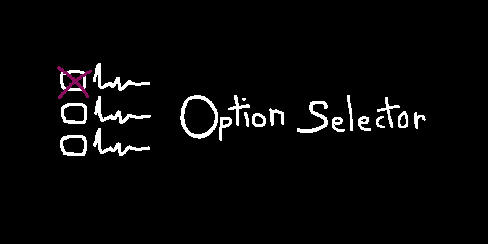

    

---

    
    &nbsp;&nbsp;
    
    &nbsp;&nbsp;
    
    &nbsp;&nbsp;
    

## Cos'è?

    E' una semplice libreria scritta in C che permette la creazione e la navigazione di una lista di opzioni in una console, 
    navigazione che avviene tramite l'uso di tasti che permettono al cursore di spostarsi tra le opzioni. 
    Permette varie opzioni di personalizzazione dalla scelta del layout della lista di opzioni, 
    al modo in cui appaiono le opzioni selezionate e non.

     

> [!IMPORTANT]
> Per la documentazione del consultare la <a href="https://github.com/Vincy-2515/option-selector/wiki">wiki della repository</a>.
